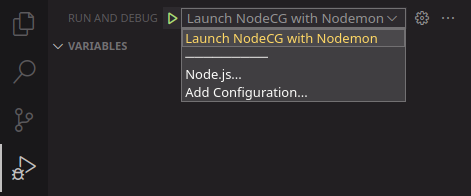
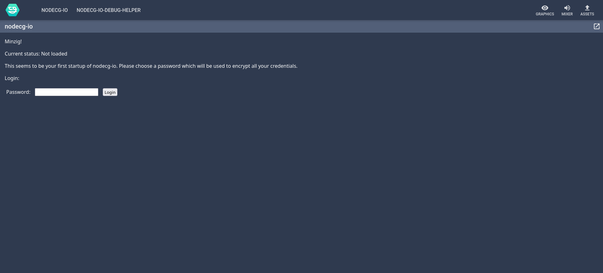

# Try an included sample

Trying one of the premade example bundles, is a good way to get to know the
framework and especially the selected service.

## Step 1: Installing the Sample

If you installed **dev** branch or cloned nodecg-io directly from GitHub all the
samples should be already installed (you can move to step 2). In case you
installed the **production** branch of nodecg-io, you may have to download the
sample before you can use it. In case you already installed it previously you
can move on to step 2.  
Installing and uninstalling of sample bundles can be done with the nodecg-io
CLI.

Run this command inside your NodeCG folder:

```shell
$ nodecg-io install
Installing nodecg-io...
```

You will be presented with a pair of options:

<!-- prettier-ignore-start -->

1. You can select the version of nodecg-io to install. **Select here the version already installed.** (Since this is not the migration guide)
    <pre><b><span style="color:#1cdc9a">user@computer</span>:<span    style="color:#3daee9">~/nodecg</span></b>$ nodecg-io install
   Installing nodecg-io...
   Detected nodecg installation at /home/user/nodecg.
   <span style="color:#11d116">?</span> <b>Which version do you want to install?</b>  (Use arrow keys) 
     development 
   <span style="color:#1abc9c">❯ 0.1</span></pre>
2. You can select the sample bundles to be included. **Select here the sample(s) you want to try.**
   <pre><b><span style="color:#1cdc9a">user@computer</span>:<span style="color:#3daee9">~/nodecg</span></b>$ nodecg-io install
   Installing nodecg-io...
   Detected nodecg installation at /home/user/nodecg.
   <span style="color:#11d116">?</span> <b>Which version do you want to install?</b> <span style="color:#1abc9c">0.1</span>
   <span style="color:#11d116">?</span> <b>Which services do you want to use?</b> (Press <span style="color:#16a085">&lt;space&gt;</span> to select, <span    style="color:#16a085">&lt;a&gt;</span> to toggle all, <span style="color:#16a085">&lt;i&gt;</span> to invert selection, and <span style="color:#16a085">&lt;enter&gt;</span> to proceed)
   <span style="color:#1abc9c">❯◯ ahk</span>
    ◯ android
    ◯ curseforge
    ◯ discord
    ◯ intellij
    ◯ irc
    ◯ midi-input
   (Move up and down to reveal more choices)</pre>

<!-- prettier-ignore-end -->

## Step 2: Run NodeCG

Now you need to start NodeCG. There are a couple of different ways to do this:

### Using VS Code

If you have nodecg-io open in your VS Code instance, you can launch NodeCG using
the `Run and Debug` Explorer View:



### Using the terminal

You also launch NodeCG using your terminal with:

<pre><b><span style="color:#1cdc9a">user@computer</span>:<spanstyle="color:#3daee9">~/nodecg</span></b>$ npm run start

> nodecg@1.8.1 start
> node index.js

info: [nodecg/lib/server] Starting NodeCG 1.8.1 (Running on Node.js v16.11.1)
info: [nodecg-io-core] Minzig!

// A whole host of logging output

info: [nodecg/lib/server] NodeCG running on http://localhost:9090</pre>

Now you can open the NodeCG dashboard under <http://localhost:9090>.

## Step 3: Log in to nodecg-io

Now navigate to the `nodecg-io` tab in the NodeCG dashboard.

If you are logging in for the first time you will have to set your password.



Else you simply have to log in with your previously chosen password.

Now you are in the `nodecg-io` config menu. It should look like this:


## Step 4: Learning how to use the GUI

The current GUI is just intended to make the project usable, but is not very
user-friendly. As a more long term solution, a new GUI will be developed that
also focuses at user experience. But till the new GUI is developed you will have
to arrange yourself with this one. So, to get started:


### In <span style="color:#b06770">pink</span>: NodeCG Tabs

Here you will find every NodeCG-bundle, which has a dashboard. Here you may
select the [`nodecg-io-debug`](../samples/debug.md)-dashboard, if you have it
installed.

### In <span style="color:#b6b61c">yellow</span>: Monaco editor

It is basically only a text editor which is used to save configurations for
service instances.

### In <span style="color:#21885c">green</span>: Services section

Here you may create, update and delete instances of a service. Each instance has
its own name and configuration. The menu will expand depending on the option
selected in the first dropdown.

_Creating a new service instance_:

This can be accomplished by selecting the item `'New'`. Then a new dropdown will
be revealed, in witch you may select the service type. Additionally, you must
select an instance name. Then click `'Create'`. The new created instance should
be selected.

_Configure a service instance_:

While a supported service instance is selected, you may change the config in
monaco, then click `'Save'`.

_Deleting a service instance_:

This can be accomplished by selecting an existing instance. Then click
`'Delete Instance'`.

### In <span style="color:#69318e">violet</span>: Bundles section

This section has tree dropdowns:

1. Bundle: Here you can select a bundle to configure.
2. Service: If this bundle uses more than one service, you can select her the
   service to set or unset.
3. Service Instance: Here you can select one instance of the service type set at
   2 or `none`.

### In <span style="color:#b71424">red</span>: Unset all Button

This button will set the service instance for every bundle/service combination
to none, effectively removing the access to every service from all bundles.  
**Caution**: This cant be undone, and you will have to set up all the bundles
again. _The service instances will be unaffected._

## Step 5: Configure the sample

The configuration for every sample bundle is too different to be included here,
so you have to take a look at the documentation for your sample bundle. You will
find it on the left-hand side of this page in the category `Services`.
